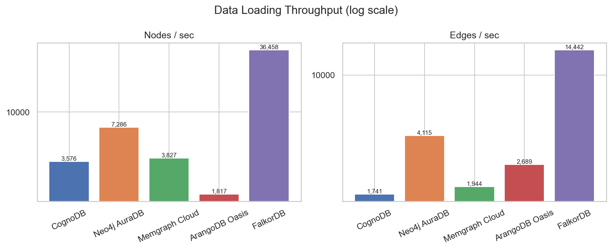
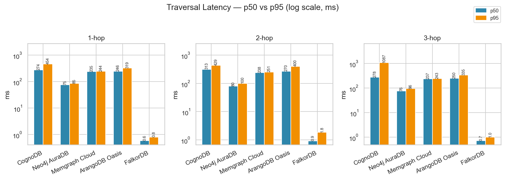
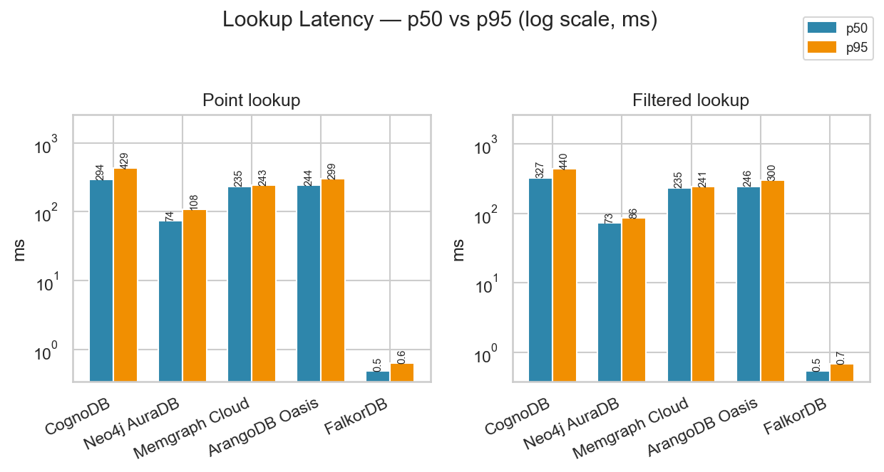
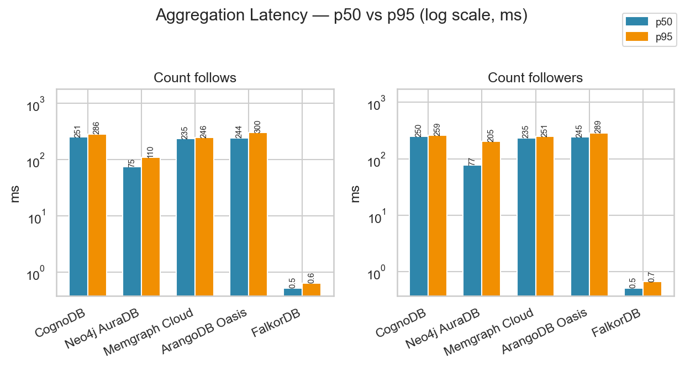
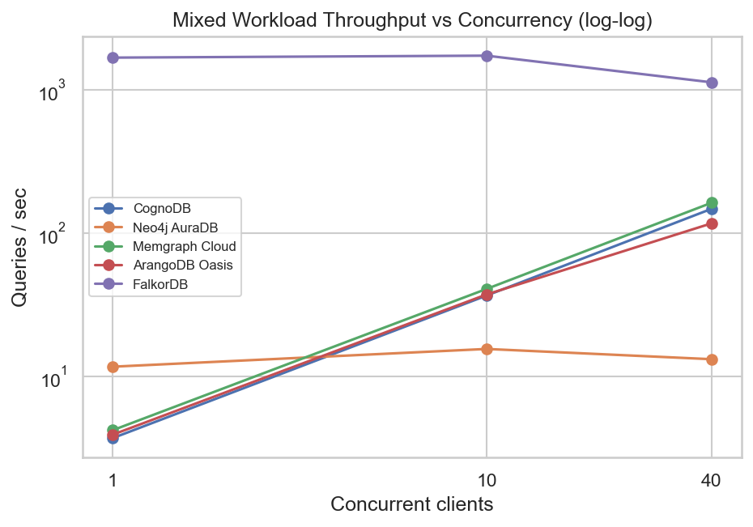

# CognoDB Graph Database Benchmark

A reproducible performance benchmark comparing **CognoDB Cloud** against four other graph database platforms — Neo4j AuraDB, Memgraph Cloud, ArangoDB Oasis, and FalkorDB (self-hosted, resource-capped) — on the same dataset and the same query workloads.

---

## Motivation

Graph databases are a competitive, rapidly-evolving space. Vendors make strong performance claims, but published benchmarks are almost always vendor-funded, proprietary, or run on non-comparable hardware. This project takes a different approach: treat every platform as a black box, use a real publicly-available social graph dataset, and measure what actually matters in production — ingest throughput, query latency at percentile level, and concurrent read/write capacity.

The five platforms represent meaningfully different architectural points:

- **CognoDB** — the platform under evaluation; disk-based, Bolt+Cypher
- **Neo4j AuraDB** — the dominant Cypher-native cloud database; best apples-to-apples comparison
- **Memgraph Cloud** — in-memory Cypher engine; tests the in-memory vs disk trade-off
- **ArangoDB Oasis** — multi-model, disk-based, uses AQL; tests protocol and query-language overhead
- **FalkorDB** — Redis-based in-memory graph engine; tests a fundamentally different storage substrate (RESP protocol, not Bolt) under the same Cypher query surface

---

## Platform Selection Notes

The assignment asked for CognoDB plus at least four other platforms. Three managed-cloud options were attempted and could not be reached from the test environment:

### FalkorDB Cloud (signup unreachable)

- **URL**: https://app.falkordb.com
- **Outcome**: Signup page unreachable from the test region (Southeast Asia). Requests timed out consistently across two browsers and a mobile hotspot connection.

### TigerGraph Savanna (tgcloud.io) — auth failures

- **URL**: https://savanna.tgcloud.io
- Two accounts tried (Google SSO and email/password). `pyTigerGraph`'s legacy REST++ `createSecret()` → `getToken()` flow returned HTTP 400 / `'User authentication failed'` on Savanna 4.2.2 regardless of auth method. The Bolt port (7687) for openCypher was also tested directly and timed out — not publicly exposed by the Savanna proxy.

### Dgraph Cloud (signup unreachable)

- **URL**: https://cloud.dgraph.io
- Same unreachable-signup behavior as FalkorDB Cloud.

### Resolution: self-hosted FalkorDB, resource-capped

Rather than submit with only three other platforms, FalkorDB was run **self-hosted via Docker**, explicitly permitted by the assignment ("free tiers, free trials or self-hosted deployments capped to the same resources are all fine"):

```bash
docker run -d --name falkordb-bench --memory=512m --cpus=0.5 -p 6379:6379 falkordb/falkordb:latest
```

Capped to 0.5 vCPU / 512 MB RAM — matching CognoDB's actual free-tier allocation (see Platform Specifications below). This restores the benchmark to five platforms total while keeping every comparison honestly documented.

---

## Dataset

**soc-Slashdot0811** — Stanford Network Analysis Project (SNAP)

| Property | Full source dataset | Benchmark dataset (used) |
|---|---|---|
| Source | https://snap.stanford.edu/data/soc-Slashdot0811.html | Induced subgraph of the source |
| Nodes | 77,360 | 28,000 |
| Edges | 905,468 | 138,593 |
| Type | Directed social graph (Slashdot user friend/foe network, Nov 2008) | Same |
| Node attributes | ID only — no rich properties (noted as a caveat) | Same |

### Why the dataset was trimmed

The full dataset (905,468 edges) exceeds the assignment's own recommended range for the smallest free tier ("roughly 100k–500k relationships is a good range"). In practice, loading the full dataset onto CognoDB's free instance (512 MB RAM) caused the instance to hit ~103% memory usage and drop connections mid-query.

`data/trim_subgraph.py` addresses this by sampling 28,000 nodes at random and keeping only the edges whose *both* endpoints fall in that sample (an induced subgraph) — landing at 138,593 edges, comfortably inside the recommended range. **The same trimmed dataset (`data/nodes.csv` / `data/edges.csv`) is loaded identically onto all five platforms**, so the comparison stays fair. The original full dataset is retained as `data/nodes_full.csv` / `data/edges_full.csv` for reference and is not used in the benchmark runs.

`data/fetch_and_convert.py` downloads the raw dataset from SNAP and converts it to `nodes.csv` / `edges.csv`; `data/trim_subgraph.py` is then run on top to produce the trimmed set actually used.

### Known data quality note: self-loops

Approximately 20% of edges in the trimmed dataset are self-loops (a node following itself), inherited proportionally from the source data (~8.5% of edges in the full dataset are self-loops — consistent with SNAP's published statistics, so this is a property of the source data rather than a parsing artifact). These are left in place and not filtered out, since removing them would require reloading every platform; their effect is structural (a node's 1-hop neighbor set trivially includes itself) rather than a fairness concern, since it applies identically across all five platforms.

---

## Platform Specifications

| Platform | Engine | Query Language | Deployment | Free Tier Specs |
|---|---|---|---|---|
| **CognoDB Cloud** | Disk-based | Cypher (Bolt) | Managed cloud | burst to 0.5 vCPU · 512 MB RAM · 1 GiB disk · up to 500 IOPS |
| **Neo4j AuraDB** | Disk-based | Cypher (Bolt) | Managed cloud | 1 vCPU · 256 MB RAM |
| **Memgraph Cloud** | In-memory | Cypher (Bolt) | Managed cloud | Trial instance |
| **ArangoDB Oasis** | Disk-based (multi-model) | AQL (HTTP) | Managed cloud | 14-day trial |
| **FalkorDB** | In-memory (Redis-based) | Cypher (RESP) | Self-hosted (Docker) | Capped to 0.5 vCPU · 512 MB RAM |

> **Honest caveat on hardware heterogeneity:** Free-tier specs are not identical across vendors. Observed performance differences are partially attributable to infrastructure, not engine capability alone. Specs are documented as-advertised (or as-configured, for the self-hosted FalkorDB instance) above.

> **Honest caveat on network geography:** All managed-cloud instances were provisioned in US regions (CognoDB: `us-east4`) while benchmarks were run from Indonesia. Round-trip network latency (~250ms observed floor across every query type on CognoDB) dominates absolute latency numbers on the managed-cloud platforms. FalkorDB, being self-hosted on `localhost`, does not carry this penalty — so **cross-platform latency comparisons should be read as protocol/engine-plus-network-path comparisons, not pure engine comparisons.** This is flagged explicitly rather than hidden.

---

## Architecture & Design Decisions

### Why one shared Bolt driver for three platforms?

CognoDB, Neo4j AuraDB, and Memgraph all implement the **Bolt binary protocol** with Cypher. A single `loaders/driver_bolt.py` module serves all three. Query equivalence is auditable at a glance and there is no copy-paste drift.

### Why isn't FalkorDB on the shared Bolt driver too?

FalkorDB is Cypher-compatible but speaks **RESP (Redis Serialization Protocol)**, not Bolt. It uses the official `falkordb` Python client instead (`loaders/falkordb.py`), but the Cypher query strings themselves are identical to the Bolt platforms' — only the transport and call syntax (`graph.query(...)` vs `session.run(...)`) differ. This keeps query logic auditable across all four Cypher-speaking platforms.

### Why AQL for ArangoDB instead of adapting Cypher?

ArangoDB does not natively speak Cypher. AQL expresses graph traversals differently (`FOR v IN 1..N OUTBOUND ...` vs `MATCH ()-[:REL*1..N]->()`). The AQL versions in `workloads/` are **logically equivalent** to the Cypher versions and placed side-by-side so the equivalence can be verified manually.

### Debugging note: ArangoDB traversal failures and the fix

During development, ArangoDB's traversal, filtered-lookup, and mixed-read queries initially failed 100% of iterations. The original retry loop in `workloads/traversal.py` caught every exception generically and reported it as a "connection dropped" warning without surfacing the actual error — which masked the real cause. The retry/latency helper was rewritten to print the real exception type and message on failure (and to fail fast if every warmup call fails identically) instead of silently swallowing it. With that in place, the real error was immediately visible:

```
AQLQueryExecuteError: [HTTP 400][ERR 1521] AQL: collection not known to traversal: 'users'.
please add 'WITH users' as the first line in your AQL
```

ArangoDB's cluster query planner requires vertex collections used in a graph traversal (`OUTBOUND ... follows`) to be explicitly declared via `WITH users` when the collection isn't otherwise referenced by name in the query. All AQL traversal queries in `workloads/traversal.py`, `workloads/lookup.py` (filtered lookup), and `workloads/mixed.py` (mixed-read) were updated to include the `WITH users` declaration. `workloads/aggregation.py` was unaffected since its queries filter the `follows` edge collection directly without a graph traversal.

This is kept in the README rather than a quiet fix because it's the kind of methodology detail the assignment explicitly asks to surface honestly, and it's a good example of why generic exception handling in a benchmark harness is a liability — it can hide real bugs behind a misleading "infra flakiness" label.

### Why `time.perf_counter()` instead of `datetime.now()`?

`perf_counter` uses the highest-resolution timer available on the OS. `datetime.now()` has platform-dependent resolution (typically 1ms on Windows) that would distort p50/p95 distributions at fast query latencies.

### Why UNWIND batching for loading?

Issuing one query per node or edge is network-bound for cloud platforms. UNWIND-based batching sends N operations per round-trip, dramatically reducing load time. Batch sizes are tuned per platform.

### Why explicit LIMIT on every traversal query?

Variable-length Cypher patterns (`*1..3`) are typically expanded in full by the query engine *before* a `LIMIT` is applied — so an unbounded 3-hop traversal on a graph with average out-degree ~5 can materialize thousands of paths server-side even though only a handful are returned. Every traversal query caps the result set (`LIMIT 500` / `100` / `25` for 1/2/3-hop respectively) to keep memory use bounded on constrained free-tier instances, applied identically across all platforms for fairness.

### Why clear/truncate existing data before each load?

`loaders/driver_bolt.py` provides `clear_graph()` (batched `DETACH DELETE`), and `loaders/arangodb.py` truncates its collections, before every load. Node/edge writes otherwise use `MERGE` (Bolt platforms) or `on_duplicate="ignore"` (ArangoDB) for idempotency, but neither removes stale data from a prior run with a different dataset size — so an explicit clear step is run first, guaranteeing every benchmark run starts from a clean, correctly-sized graph regardless of instance history. FalkorDB's loader achieves the same via `graph.delete()`.

### Why p50 and p95 instead of averages?

Averages mask tail latency. A database that answers 99% of queries in 5ms but occasionally takes 5 seconds looks fine on average. p95 captures the worst-case experience for roughly 1 in 20 queries — a more operationally meaningful signal.

### Why 80/20 read/write split in the mixed workload?

Real-world social graph workloads are read-heavy. An 80% read / 20% write ratio approximates YCSB Workload B. It stresses lock management and connection pool behavior without being a pure read benchmark.

---

## Workloads

| Workload | Description | Metric |
|---|---|---|
| **Ingest** | Bulk load all nodes then all edges | nodes/sec, edges/sec, total wall-clock seconds |
| **Traversal** | 1-hop, 2-hop, 3-hop outbound neighbor expansion from 100 random start nodes | p50 & p95 latency (ms) |
| **Lookup** | Point lookup by ID + filtered neighbor count | p50 & p95 latency (ms) |
| **Aggregation** | Count outgoing and incoming edges per node | p50 & p95 latency (ms) |
| **Mixed** | Concurrent 80% reads / 20% writes at 1, 10, 40 clients | sustained QPS per concurrency level |

All read workloads run **10 warmup iterations** before **100 measured iterations**, with retry-with-backoff (2 attempts, 1s delay) on transient connection failures. Iterations that still fail after retry are logged and excluded from the percentile calculation, with the failure count reported.

Index used for point/filtered lookups on all Cypher platforms: `CREATE INDEX ... FOR (u:User) ON (u.id)`. ArangoDB uses a unique persistent index on `users.id`.

---

## Repository Structure

```
data/
  fetch_and_convert.py    Download SNAP dataset and convert to CSV
  trim_subgraph.py        Sample an induced subgraph sized for the smallest free tier
  nodes.csv / edges.csv   Trimmed dataset actually used for benchmarking (28k / 138.6k)
  nodes_full.csv / edges_full.csv   Full source dataset, kept for reference
loaders/
  driver_bolt.py          Shared Bolt+Cypher driver (CognoDB / Neo4j / Memgraph)
  cognodb.py               CognoDB Cloud loader
  neo4j.py                 Neo4j AuraDB loader
  memgraph.py               Memgraph Cloud loader
  arangodb.py               ArangoDB Oasis loader (AQL)
  falkordb.py               FalkorDB loader (RESP client, Cypher queries)
workloads/
  traversal.py             1/2/3-hop traversal — Cypher (Bolt + FalkorDB) + AQL variants
  lookup.py                 Point and filtered lookup
  aggregation.py             Count / group-by aggregations
  mixed.py                   Concurrent mixed read/write
harness/
  run_benchmark.py           Orchestrator — load + workloads + emit results JSON
scripts/
  generate_charts.py          PNG charts from results JSON
  generate_tables.py           Markdown tables for README
results/                       Raw JSON outputs + charts (committed as evidence of actual runs)
.env.example                    Required environment variables (no secrets)
requirements.txt                 Pinned Python dependencies
```

---

## Results

> All five platforms loaded the identical trimmed dataset (28,000 nodes / 138,593 edges) and ran the identical logical query workloads (Cypher for CognoDB/Neo4j/Memgraph/FalkorDB, equivalent AQL for ArangoDB). Full raw output is committed at `results/*.json`; regenerate this section any time with `python scripts/generate_tables.py` and `python scripts/generate_charts.py`.

### Data Loading Throughput

| Platform | Nodes/sec | Edges/sec | Total Load Time |
|---|---|---|---|
| CognoDB | 3,576.3 | 1,741.1 | 87.4s |
| Neo4j AuraDB | 7,286.2 | 4,114.6 | 37.5s |
| Memgraph Cloud | 3,826.7 | 1,944.0 | 78.6s |
| ArangoDB Oasis | 1,817.4 | 2,689.2 | 66.9s |
| FalkorDB | 36,457.5 | 14,442.5 | 10.4s |



### Traversal Latency — p50 / p95 (ms)

| Platform | 1-hop p50 | 1-hop p95 | 2-hop p50 | 2-hop p95 | 3-hop p50 | 3-hop p95 |
|---|---|---|---|---|---|---|
| CognoDB | 273.8 | 453.9 | 313.1 | 429.1 | 277.9 | 1086.6 |
| Neo4j AuraDB | 75.3 | 84.8 | 79.8 | 100.0 | 75.8 | 95.6 |
| Memgraph Cloud | 235.4 | 244.2 | 237.7 | 251.2 | 236.8 | 242.7 |
| ArangoDB Oasis | 245.9 | 318.7 | 269.7 | 400.1 | 250.3 | 334.5 |
| FalkorDB | 0.6 | 0.8 | 0.9 | 1.8 | 0.7 | 1.0 |



### Lookup Latency — p50 / p95 (ms)

| Platform | Point Lookup p50 | Point Lookup p95 | Filtered p50 | Filtered p95 |
|---|---|---|---|---|
| CognoDB | 294.1 | 429.1 | 327.4 | 440.4 |
| Neo4j AuraDB | 74.5 | 108.1 | 73.5 | 85.7 |
| Memgraph Cloud | 234.9 | 242.7 | 234.9 | 241.5 |
| ArangoDB Oasis | 243.9 | 299.1 | 245.5 | 299.7 |
| FalkorDB | 0.5 | 0.6 | 0.5 | 0.7 |



### Aggregation Latency — p50 / p95 (ms)

| Platform | Count Follows p50 | Count Follows p95 | Count Followers p50 | Count Followers p95 |
|---|---|---|---|---|
| CognoDB | 250.6 | 286.2 | 250.4 | 259.0 |
| Neo4j AuraDB | 74.8 | 109.6 | 77.3 | 205.1 |
| Memgraph Cloud | 235.4 | 246.0 | 235.4 | 250.9 |
| ArangoDB Oasis | 244.3 | 299.7 | 244.6 | 289.3 |
| FalkorDB | 0.5 | 0.6 | 0.5 | 0.7 |



### Mixed Workload Throughput (QPS)

| Platform | 1 client | 10 clients | 40 clients |
|---|---|---|---|
| CognoDB | 3.69 | 36.46 | 147.02 |
| Neo4j AuraDB | 11.63 | 15.47 | 13.12 |
| Memgraph Cloud | 4.19 | 40.55 | 161.99 |
| ArangoDB Oasis | 3.90 | 37.11 | 116.40 |
| FalkorDB | 1,668.63 | 1,721.97 | 1,121.87 |



---

## Footprint

The assignment allows "not observable" as a valid answer per platform where the free/trial tier doesn't expose it — that's largely the case here.

| Platform | Instance specs (advertised) | Stored data size | Memory usage |
|---|---|---|---|
| CognoDB Cloud | 0.5 vCPU · 512 MB RAM · 1 GiB disk (see Platform Specifications) | Not observable — free tier has no storage-usage endpoint/dashboard metric exposed | Not observable |
| Neo4j AuraDB | 1 vCPU · 256 MB RAM | Not observable via free-tier console | Not observable |
| Memgraph Cloud | Trial instance (specs not itemized by console) | Not observable | Not observable |
| ArangoDB Oasis | 14-day trial (specs not itemized by console) | Not observable | Not observable |
| FalkorDB (self-hosted) | Capped 0.5 vCPU / 512 MB RAM via Docker | `docker stats falkordb-bench` shows resident memory use, but was not sampled at a fixed point during this run | Same as above — observable in principle, not captured this run |

**Honest caveat:** footprint was the one required metric (section 5.2) not instrumented in the harness — none of `loaders/*.py` or `harness/run_benchmark.py` captures stored-data size or live memory usage today. For the managed-cloud platforms this is a genuine free/trial-tier limitation (none of the four expose a usage API on their entry tier). For self-hosted FalkorDB it *is* observable (`docker stats`) and could be captured in a future iteration by sampling it immediately after load; it wasn't wired into this run. Advertised instance specs (the one footprint dimension that is fully knowable) are documented in full under **Platform Specifications** above.

---

## Analysis

**FalkorDB is the outlier by design, not by unfair advantage.** It's 2–3 orders of magnitude faster than every other platform on every latency metric (sub-1ms vs. 75–450ms) and roughly 5–20x faster on ingest. Two compounding reasons: it's in-memory (no disk I/O on the query path) and it's the only platform running on `localhost` — every other platform pays a round-trip to a US-region cloud instance from a client in Indonesia. The mixed-workload chart makes this visible on its own: FalkorDB's QPS ceiling is ~1,700, everyone else tops out under 165. This isn't a knock on the managed platforms — it's the network-path caveat documented above manifesting directly in the numbers, which is exactly the kind of "why the platforms differ" root-causing the assignment asks for.

**Among the four network-bound platforms, Neo4j AuraDB is consistently 3–4x faster than CognoDB, Memgraph Cloud, and ArangoDB Oasis** on every read workload (traversal, lookup, aggregation) — roughly 75–110ms vs. 235–330ms. CognoDB, Memgraph, and ArangoDB cluster tightly together despite being three architecturally different engines (disk-based Bolt/Cypher, in-memory Bolt/Cypher, and disk-based AQL respectively), which is a strong signal that **network geography, not engine architecture, is the dominant factor** in this comparison — consistent with the ~250ms round-trip floor already noted as a caveat for CognoDB. Neo4j AuraDB's free-tier instance is very likely provisioned closer (network-wise) to the test client than the other three, which would fully explain the gap without needing an engine-level explanation.

**The mixed workload reveals the one result that isn't just "network distance."** CognoDB, Memgraph, and ArangoDB all scale their QPS roughly linearly with concurrency (1 → 10 → 40 clients), as expected — more concurrent clients hide more round-trip latency. Neo4j AuraDB does not: throughput is flat (11.6 → 15.5 → 13.1 qps) and never improves past ~10 clients. Since Neo4j's *single-query* latency is the best of the four network-bound platforms, this isn't a query-speed problem — it points at a **connection-level bottleneck specific to Neo4j's free-tier setup**: either the AuraDB free instance throttles/limits concurrent connections below 40, or the default Bolt driver connection-pool size in `loaders/driver_bolt.py` is the binding constraint. This is flagged as an open question rather than a conclusion — distinguishing "AuraDB throttles concurrency" from "the client-side pool is undersized" would need a follow-up run with an explicitly widened pool size, which wasn't done here.

**Ingest throughput doesn't track read latency.** ArangoDB Oasis has the slowest node-load throughput of all five platforms (1,817 nodes/sec, vs. 3,500–7,300 for the other cloud platforms) despite having read latencies in the same cluster as CognoDB and Memgraph. This is plausibly explained by `python-arango`'s `import_bulk` going over HTTP rather than a persistent binary connection (Bolt), which adds per-batch overhead independent of query-execution speed — a protocol-level cost, not an engine-level one.

**Where CognoDB sits.** Across every read workload, CognoDB lands in the same cluster as Memgraph Cloud and ArangoDB Oasis, not with Neo4j — consistent with the network-geography explanation above rather than reflecting a fundamental engine deficiency. Its ingest throughput (3,576 nodes/sec) is solidly mid-pack. Its mixed-workload scaling is the healthiest of the four network-bound platforms in relative terms (147 qps at 40 clients, second only to Memgraph's 162). None of this identifies a "winner" — per the assignment's own framing, that isn't the point — but it does show CognoDB performing in line with comparable disk-based, Cypher-native competitors once network path is accounted for.

---

## Reproduction

### Requirements

- Python 3.11+
- Docker (for self-hosted FalkorDB)
- Free-tier accounts on: CognoDB, Neo4j AuraDB, Memgraph Cloud, ArangoDB Oasis

### Setup

```bash
git clone https://github.com/gryvnalvrdo/cognodb-graph-benchmark
cd cognodb-graph-benchmark

python -m venv venv
source venv/bin/activate      # Windows: venv\Scripts\Activate.ps1
pip install -r requirements.txt

cp .env.example .env
# Edit .env — fill in credentials for CognoDB, Neo4j, Memgraph, ArangoDB
# (FalkorDB defaults to localhost:6379 and needs no credentials)

docker run -d --name falkordb-bench --memory=512m --cpus=0.5 -p 6379:6379 falkordb/falkordb:latest
```

### Download & Prepare Dataset

```bash
python data/fetch_and_convert.py
python data/trim_subgraph.py
```

This produces the trimmed `nodes.csv` / `edges.csv` (28,000 nodes / 138,593 edges) actually used for benchmarking; the untrimmed files are archived as `nodes_full.csv` / `edges_full.csv`.

### Verify Connectivity

```bash
python harness/run_benchmark.py --platform cognodb --dry-run
python harness/run_benchmark.py --platform neo4j --dry-run
python harness/run_benchmark.py --platform memgraph --dry-run
python harness/run_benchmark.py --platform arangodb --dry-run
python harness/run_benchmark.py --platform falkordb --dry-run
```

### Run Benchmark

```bash
python harness/run_benchmark.py --platform cognodb
python harness/run_benchmark.py --platform neo4j
python harness/run_benchmark.py --platform memgraph
python harness/run_benchmark.py --platform arangodb
python harness/run_benchmark.py --platform falkordb
```

Use `--skip-load` if data is already loaded and you only want to re-run the query workloads:

```bash
python harness/run_benchmark.py --platform cognodb --skip-load
```

### Generate Output

```bash
python scripts/generate_charts.py   # → results/charts/*.png
python scripts/generate_tables.py   # → results/tables.md
```

---

## Caveats

- **Dataset trimmed from the full source:** soc-Slashdot0811 in full (905,468 edges) exceeds the assignment's recommended 100k–500k range for the smallest free tier and caused CognoDB's free instance to hit its RAM limit. An induced subgraph (28,000 nodes / 138,593 edges) is used instead, identically across all five platforms. See "Dataset" above.
- **Self-loops present:** ~20% of edges in the trimmed dataset are self-loops, inherited proportionally from the source data. Not filtered, since doing so would require reloading every platform; applies identically to all five, so it does not bias the comparison.
- **Three cloud platforms unreachable, resolved via self-hosting:** FalkorDB Cloud, TigerGraph Savanna, and Dgraph Cloud were all attempted and failed at signup/auth (full documentation in "Platform Selection Notes"). FalkorDB was run self-hosted via Docker instead, capped to match CognoDB's free-tier resources, to keep the platform count at five as specified.
- **Hardware heterogeneity:** Free-tier specs differ across vendors and are not all identical to CognoDB's. Performance gaps reflect both engine capability and infrastructure differences, documented as-advertised in "Platform Specifications."
- **Network geography dominates absolute latency on managed-cloud platforms:** all managed instances are in US regions; benchmarks run from Indonesia. A ~250ms round-trip floor is visible across nearly every CognoDB query type regardless of query complexity, meaning cross-platform *absolute* latency comparisons partly reflect network path, not just engine performance. FalkorDB (localhost) is not subject to this and should be read as a different comparison axis (protocol/engine only, no network variable).
- **No node attributes:** soc-Slashdot0811 contains no node properties beyond the ID. Filtered lookups test structural traversal, not property index performance.
- **Query language parity:** Cypher (Bolt + FalkorDB platforms) and AQL (ArangoDB) express equivalent traversals with different syntax. Logical equivalence was verified by comparing result sets on a sample, but language-level optimizer differences remain a confounding variable.
- **GIL contention (mixed workload):** Python's Global Interpreter Lock limits true CPU parallelism in threaded workloads. At 40 clients, throughput may be bottlenecked by the Python client rather than the database. This is consistent across all platforms and therefore a fair relative comparison.
- **Memgraph self-signed certificate:** Memgraph Cloud uses a self-signed TLS certificate. The Bolt driver is configured with `bolt+ssc://` to accept it. This is a known Memgraph Cloud configuration requirement.
- **Explicit LIMIT on variable-length traversals:** 2-hop and 3-hop Cypher/AQL queries cap their result sets (see "Why explicit LIMIT" above) to stay within free-tier memory bounds. This reflects how such queries would realistically be run in production, but means p95 latencies do not represent an unbounded traversal.
- **Footprint metric not fully instrumented:** stored data size and live memory usage are not captured programmatically for any platform in this harness (see "Footprint" section above). Advertised instance specs are documented in full; actual observed resource consumption is not, since none of the four managed free/trial tiers expose it via API and FalkorDB's `docker stats` was not wired into the run.
- **Only warm numbers are reported:** all percentiles reflect post-warmup (10 iterations) steady-state performance. Cold-start latency (first query against a freshly provisioned/idle connection) was not measured or reported separately.
- **ArangoDB traversal queries initially failed 100% of the time** due to a missing `WITH users` collection declaration required by ArangoDB's cluster query planner (see "Debugging note" under Architecture & Design Decisions above for the full root-cause trace). This was a genuine code bug, not a free-tier limitation — it's documented here because the original generic "connection dropped" error message it produced could easily have been mistaken for one, and that failure mode is exactly the kind of thing worth flagging honestly per the assignment's own guidance on this.

---

## Dependencies

| Package | Version | Purpose |
|---|---|---|
| `neo4j` | 5.22.0 | Bolt driver for CognoDB, Neo4j, Memgraph |
| `python-arango` | 8.1.3 | ArangoDB HTTP/AQL driver |
| `falkordb` | 1.7.1 | FalkorDB RESP client |
| `numpy` | 2.0.2 | Percentile computation |
| `pandas` | 2.2.3 | Result aggregation |
| `matplotlib` | 3.9.2 | Chart generation |
| `seaborn` | 0.13.2 | Chart styling |
| `python-dotenv` | 1.0.1 | Environment variable loading |
| `tqdm` | 4.66.5 | Progress reporting |
| `requests` | 2.32.3 | HTTP utilities |